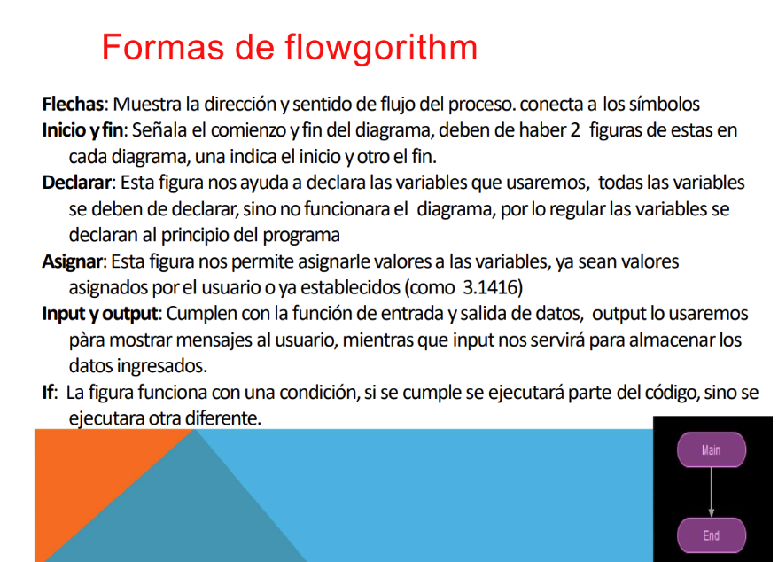
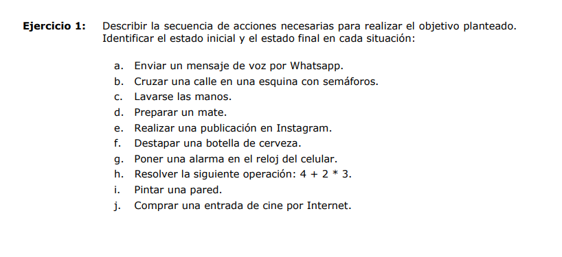

# Clase 1

## Algoritmo

Secuencia finita de pasos que describe el proceso a seguir para solucionar un problema dado.

### Alcance

Para resolver un problema es importante delimitar el alcance del mismo, eso nos va a dar un punto final a a la hora de crear la solucion.

## Programa

Es la implementacion del algoritmo, escrito en un lenguaje de programacion.

## Lenguaje de programacion

Es un lenguaje formal compuesto por un conjunto de simbolos y reglas sintacticas que se utiliza para darle instrucciones a una computadora.

# Componentes de un algoritmo

## ENTRADA --> PROCESO --> SALIDA

- Entrada (Info que se le da al algoritmo)
- Proceso (Operaciones o calculos para encontrar la solucion)
- Salida (Resultado del algoritmo)

### Entrada

1. Que datos se ingresaran?
2. Cuantos datos se ingresaran?
3. Que datos son validos de entrada?

### Salida

1. Cuales son los datos de salida?
2. Cuantos datos de salida se produciran?

### Pasos para diseñar un algoritmo:

1. Identificar las tareas mas importantes para resolver el problema.
2. Poner en orden las tareas del punto anterior, segun el orden de ejecucion.
3. Refinar pasos 1 y 2 añadiendo detalles.
4. Obtener un algoritmo claro, preciso y completo.

### Herramientas para armar un algoritmo antes de programarlo:

Pseudocodigo
Diagramas de flujo

## Datos

- Son partes de la informacion.
- No tienen significado en si mismo.
- Ej "Carlos Gonzalez" que es? Un negocio? una persona? etc.

### Pueden ser:

- Simples: Representa un solo valor. -> Nro. Entero -- Nro. Decimal -- Letra.
- Complejos: Son un conjunto de datos simples. -> Vectores - Matrices.

Matrices y vectores (que son en si matrices): Son estructuras de datos en que se diferencian en estructura.

Matriz:
[1, 2, 3]
[6, 7, 8]
[9, 10, 11]

Vector:
[1, 2, 3, 4, 5]

## Compilador

Convierte el programa fuente, escrito en un lenguaje de alto nivel, lo empaqueta en un programa _objeto_.
Este programa _objeto_ debe ser enlazado o vinculado con bibliotecas proporcionada por el fabricante, creando asi el programa _ejecutable_.

## Interprete

Interpreta linea por linea el codigo fuente y ejecuta el programa.

# Diagramas de Flujo

Flowgorithm: Herramienta para armar diagramas de flujo

Son **recursos visuales** que se usan para representar un algoritmo que utilizan simbolos y flechas en lugar de palablas.

Los simbolos tienen un significado definido y se unen mediante flechas, las cuales indican el flujo.

## Reglas para diseñar diagramas de flujo:

1. Los diagramas siempre, se escriben de arriba a abajo y de izquierda a derecha
2. Dentro de cada simbolo se escribe un texto que indica la operacion a realizar.
3. Los simbolos se unen con flechas (Lineas de flujo), las cuales unicamente pueden ser horizontales y verticales.
4. No debe haber simbolos sin conectar.
5. Tiene que tener una figura inicial y final.

## Poner una alarma en el reloj del celular

1. Encender el celular
2. Desbloquear el celular
   Tengo los datos - Ingresar la contraseña o los datos necesarios para ingresar
   No tengo los datos - Buscar forma de recuperar el acceso
3. Buscar atajo de reloj en la home del celular
   Existe - Abrir app de reloj.
   No existe - Buscar app de reloj manualmente y abrirla
4. Ingresar al menu de creacion de alarma.
5. Ingresar fecha
6. Ingresar hora
7. Se repite?
   Si - Ingresar dias de la semana en las que se repite.
   No - No hacer nada.
8. Guardar información de la alarma.

a. Enviar un mensaje de voz por Whatsapp. 
1. Encender el celular 
2. Desbloquear el celular
    Tengo los datos - Ingresar la contraseña o los datos necesarios para ingresar
    No tengo los datos - Buscar forma de recuperar el acceso 
3. Buscar la app de whatsapp
4. Abrir la app de whatsapp
5. Elegir el chat
6. Comenzar grabacion del audio
7. Detener grabacion del audio
8. El audio tiene el contenido deseado?
    Si - Enviar audio
    No - Borrar audio y volver a punto 6

b. Cruzar una calle en una esquina con semáforos.
    1. Llego a la esquina
    2. El semaforo esta en rojo?
        Si - Tengo el tiempo suficiente para cruzar?
            Si - Avanzar para cruzar la calle.
            No - Esperar a siguiente corte de semaforo.
        No - Esperar al corte de semaforo

c. Lavarse las manos.
    1. Acercarse a la fuente de agua.
    2. Activar fuente de agua.
    3. Sale agua?
        Si - Acercar las manos al agua.
        No - Buscar fuente alternativa de agua y volver al punto 1
    4 - Tengo Jabon?
        Si - Añadir Jabon a las manos.
        No - Continuar sin Jabon
    5 - Frotar las manos bajo el agua
    6 - Mis manos estan sucias?
        Si - Volver al punto 4
        No - Retirar las manos del agua y desactivar la fuente de agua
    7 - Tengo una forma de secarme las manos?
        Si - Proceder a secarme las manos
        No - Que las seque el viento =)

d. Preparar un mate.
    1. Tengo mate/recipiente, bombilla, yerba y agua?
            Si - Continuar haciendo el mate
            No - Terminar proceso
    2. El agua esta caliente?
        Si - Depositar el agua dentro de un termo
        No - Calentar el agua y volver al punto 2
    3. Depositar la yerba dentro del mate/recipiente
    4. Insertar la bombilla
    5. Agregar agua
    6. El agua esta a nivel correcto?
        Si - Dejar de agregar agua
        No - Volver al punto 5
    7. La ronda es > a 1 persona?
         Si - Es el primer mate?
            Si - Tomar primer mate
            No - Pasar mate al siguiente en la ronda y esperar a recibirlo para volver al punto 5
         No - Tomar el mate y volver al punto 5 al terminar.

e. Realizar una publicación en Instagram.
    1. Encender el celular 
2. Desbloquear el celular
    Tengo los datos - Ingresar la contraseña o los datos necesarios para ingresar
    No tengo los datos - Buscar forma de recuperar el acceso 
3. Buscar la app de Instagram
4. Abrir la app de Instagram
5. Buscar el boton de "Nueva publicacion"
6. Elegir elemento multimedia a publicar
7. Se agrega una descripcion?
    Si - Añadir el contenido
    No - Continuar
8. Publicar

f. Destapar una botella de cerveza.
    1. Agarrar botella
    2. La Tapa requiere un abridor?
        Si - Tengo un abridor?
            Si - Abrir la botella
            No - Cancelar proceso
        No - Utilizar metodo de apertura facil

h. Resolver la siguiente operación: 4 + 2 \* 3.
    1. Multiplicar 2 por 3 y guardar el resultado
    2. Sumar 4 al resultado previo 

i. Pintar una pared.
    1. Tengo pintura?
        Si - Continuar
        No - Cancelar proceso
    2. Tengo rodillo?
        Si - Agarrar el rodillo
        No - Tengo otra herramienta utilizable?
            Si - Utilizarla
            No - Cancelar proceso
    3. Sumergir rodillo en la pintura
    4. Apoyar rodillo en la pared
    5. Mover rodillo por los espacios no pintados
    6. Esta pintada la pared?
        Si - Detener proceso
        No - Continuar 
    7. El rodillo esta seco?
        Si - Volver al punto 3
        No - Continuar

j. Comprar una entrada de cine por Internet.
    1. Elegir pelicula
    2. Elegir cine a asistir
    3. Ingresar al sitio del cine
    4. Esta en cartelera la pelicula?
        Si - Continuar
        No - Descartar pelicula y volver al punto 1
    6. Elegir dia
    7. Hay funciones?
            Si - Elegir horario
                 Hay Lugar?
                    Si - Elegir una butaca vacia y continuar
                    No - Descartar horario y volver al punto 7
            No - Descartar dia y volver al punto 6
    8. Ingresar datos de pago
    9. Proceder al pago.
    10. Se ha completado el pago exitosamente?
        Si - Guardar detalles de reserva y finalizar
        No - Revisar datos de pago y volver al punto 8
